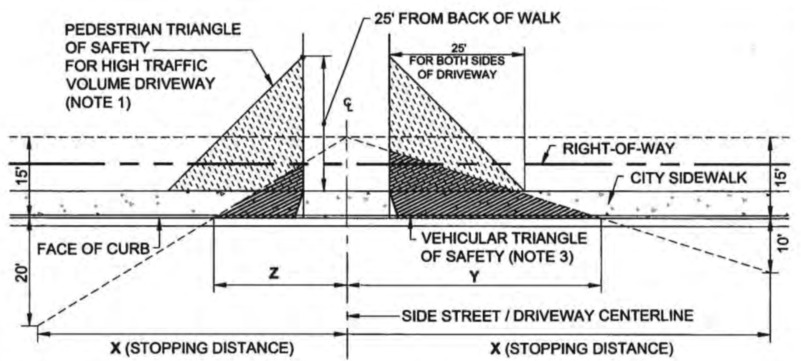
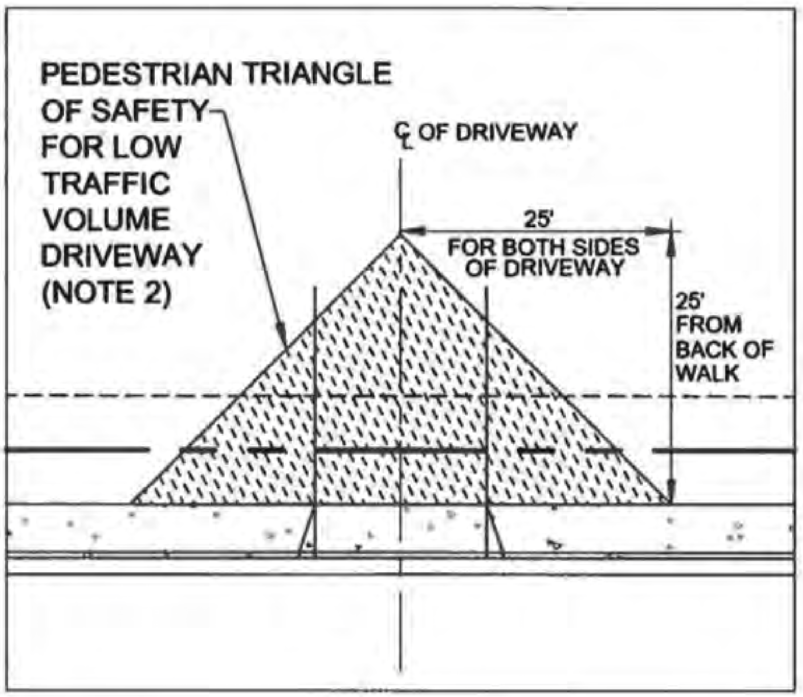

# Final report for the city of Mountain View

## Background
The state of California has a standard for creating sight triangles (also known as triangles of safety) at intersections. The city of Mountain View creates site triangles at two types of locations: street intersections and driveways. There cannot be any obstructions at eye level (six feet above ground) within these triangles. If a tree is present in an indicated sight triangle, Mountain View may require its removal as a condition of approval (CoA) for the redevelopment of a property.

Mountain View's [Standard Detail A-22](../driveway-sight-triangle-policies/mountain-view-a-22.pdf) (2019) defines pedestrian triangles of safety for two different cases: a high-volume case and a low-volume case. Both triangles are right isosceles triangles with 25-foot legs, with two per driveway.

| High-volume triangle | Low-volume triangle |
| --- | --- |
| applied to "commercial/retail areas, and residential areas with more than 20 units" | applied to "residential areas with 20 units or less" |
| triangles begin at the intersection of the corner of the driveway and sidewalk | triangles begin at the intersection of the middle of the driveway and the sidewalk |
|  |  |

## Overview
This summer, the majority of my work with Mountain View consisted of analyzing this policy from three angles:
1. A pedestrian safety standpoint: statistically, would this policy keep people safe?
2. An environmental standpoint: how many trees could this policy impact?
3. A standards-based standpoint: how does this policy compare to policies (or lack thereof) from other Santa Clara County cities?

---

## Pedestrian safety analysis
__Summary: Visibility issues in driveway sight triangles in Mountain View may be associated with up to an average of 1.7 crashes per year (1.6 for high-volume triangles; 0.1 which are unclear: either low or high-volume).__

### Obtaining a spreadsheet of crash data
After creating a free account, I downloaded crash data from UC Berkeley's [Transportation Injury Mapping System (TIMS)](https://tims.berkeley.edu/tools/query/) with the following filters applied:
- Date range: January 1st, 2010 to December 31st, 2019 (ten years)
- Location: Mountain View (Santa Clara County)
- Party Type: 2 (Pedestrian)

This search yielded data for 245 total crashes (15 fatal, 32 severe, 105 other visible, 93 complaint of pain). See [data/tims-crashes.csv](../data/tims-crashes.csv) and [data/tims-victims.csv](../data/tims-victims.csv) for the crash data and victim data. Note that tims-crashes.csv was edited for GIS compatibility as follows:
- Column LONGITUDE was renamed LONGITUDE_2 (most rows did _not_ have values for this)
- Column LATITUDE was renamed LATITUDE_2 (most rows did _not_ have values for this)
- Column POINT_X was renamed LONGITUDE (most rows did have values for this)
- Column POINT_Y was renamed LATITUDE (most rows did have values for this)

### Obtaining crash reports for potentially relevant crashes
Out of these 245 crashes, our goal was to determine how many were associated with driveways. We sought to obtain summaries of police reports for crashes from the Mountain View Police Department (MVPD) to learn more about them. Because this process is time and resource intensive, I first used QGIS to figure out which crashes occurred close to driveways. Our methodology involved extending rectangles 25 feet in each direction along the roadside from the driveway edge and then halfway into the street.

The files in [relevance-polygons](../relevance-polygons) contain the very rough sketching we used when considering the crashes for which to request report summaries.

69 out of 245 crashes occurred within these rectangles (or very close—at our discretion); so we requested their crash report summaries from the MVPD. Note that these full crash report summaries are intentionally not included in this repository because we did not obtain permission to publish them at the time of writing.

We received data for 68 of these crashes. We did not receive data for the crash with TIMS Case ID 6266634 (requested in batch 3). I will look into this during fall quarter AY 2022–2023.

The files [data/full-crash-spreadsheet.csv](../data/full-crash-spreadsheet.csv), [data/high-volume-crash-spreadsheet.csv](../data/high-volume-crash-spreadsheet.csv), and [data/unclear-crash-spreadsheet.csv](../data/unclear-crash-spreadsheet.csv) each have MVPD case numbers in addition to any potential discrepancies between the TIMS and MVPD data noted in the columns MV_CASE and TIMS_MV_DISCREPANCIES, respectively. Note that these columns only have values for the 68 crashes we received data for; otherwise, they are left blank.

### Figuring out which crashes could be associated with driveways
We manually read the crash reports for the 68 potential driveway crashes to scan them for any references to driveways. 23 of the summaries appear to be associated with driveways, averaging 2.3 crashes per year (over 10 years):

| MVPD Case Number | TIMS Case ID | Severity | Notes |
| --- | --- | --- | --- |
| 11-06195 | 5372486 | Complaint of pain | A driver hit a skateboarding pedestrian who was passing in front of a gas station |
| 12-00485 | 5459117 | Other visible | A driver hit a pedestrian in a crosswalk while exiting a driveway at Google |
| 11-07893 | 5462338 | Other visible | A driver hit two pedestrians while making a left turn to exit a 152-unit ([source: apartments.com](https://www.apartments.com/greendale-apartments-fully-renovated-mountain-view-ca/l6g0vng/)) apartment complex after making a complete stop |
| 12-01941 | 5608445 | Other visible | A driver hit a pedestrian while turning right and looking left to exit a driveway in a commercial area after making a complete stop |
| 16-00422 | 7180523 | Complaint of pain | A driver hit a pedestrian while exiting a shopping center |
| 18-01794 | 8610107 | Complaint of pain | A driver hit a pedestrian while exiting a shopping center |
| 18-06298 | 8711012 | Other visible | A driver hit a pedestrian while exiting a parking lot after making a complete stop |
| 19-02185 | 8833159 | Complaint of pain | A driver hit two pedestrians wearing dark clothing while turning left into a driveway during dark and rainy weather |
| 19-03788 | 8878802 | Complaint of pain | A driver hit a pedestrian while backing out of a driveway where large hedges blocked the driver's view. It is unclear whether the driver was exiting a 27-unit ([source: apartmentguide.com](https://www.apartmentguide.com/apartments/California/Mountain-View/Calderon-Apartments/100014157/)) apartment complex or a nearby single-family residence. |
| 19-08606 | 9008827 | Complaint of pain | A driver hit a pedestrian while making an unsafe turn into a parking lot |
| 15-06663 | 7110585 | Complaint of pain | A driver hit a pedestrian while turning right out of a parking lot |
| 16-05415 | 8113146 | Complaint of pain | A driver hit a pedestrian in a wheelchair while turning right to exit a shopping center |
| 17-00688 | 8306016 | Complaint of pain | A driver hit a pedestrian while turning right to exit a private driveway that appears to be shared by commercial and multi-unit residential properties |
| 17-07432 | 8489082 | Complaint of pain | A driver (direction unknown) hit a pedestrian on a sidewalk while they were walking across the driveway in a commercial area |
| 18-00946 | 8563718 | Complaint of pain | A driver hit a pedestrian while turning into the driveway |
| 18-05330 | 8689681 | Other visible | A driver hit two pedestrians in the road while reversing after passing a driveway |
| 18-06196 | 8711232 | Other visible | A driver hit a skateboard-riding pedestrian while attempting to turn left into a driveway |
| 19-05263 | 8924201 | Other visible | A driver hit a pedestrian on the sidewalk while exiting a driveway. This appears to have been a commercial/private driveway (the police report indicated the crash occurred at the intersection of the east sidewalk and the driveway). |
| 12-00666 | 5513864 | Other visible | A driver hit a pedestrian while making a left turn to exit a parking lot |
| 16-02776 | 8039391 | Severe injury | A driver hit two pedestrians while exiting a Costco parking lot |
| 15-00879 | 6854244 | Fatal | A driver hit a pedestrian in the crosswalk while making a left turn out of a parking lot |
| 17-08533 | 8537113 | Severe injury | A driver hit a pedestrian who was helping a second vehicle exit a driveway |
| 18-07705 | 8749365 | Complaint of pain | A driver hit a pedestrian while exiting a parking lot |

Out of these 23 driveway crashes, we wanted to know how many could be directly associated with an obstruction of vision in driveway sight triangles. We excluded crashes where drivers were entering driveways, in addition to any other crashes where exit visibility would not have been an issue. This left us with 17 crashes (an average of 1.7 per year). At this stage, we also grouped crashes by whether they occurred at a high-volume area (commercial/retail areas and residential areas with >20 units) or a low-volume area (residential areas with ≤20 units). This distinction is important, as Mountain View's driveway sight triangles are different at each of these types of locations. At least 16 crashes appear to have occurred at high-volume locations. For one case, it is unclear from the information available whether it occurred at a high or low-volume location.

#### High-volume cases (16; ~6.5% of crashes involving pedestrians):
| MVPD Case Number | TIMS Case ID | Severity | Notes |
| --- | --- | --- | --- |
| 11-06195 | 5372486 | Complaint of pain | A driver hit a skateboarding pedestrian who was passing in front of a gas station |
| 12-00485 | 5459117 | Other visible | A driver hit a pedestrian in a crosswalk while exiting a driveway at Google |
| 11-07893 | 5462338 | Other visible | A driver hit two pedestrians while making a left turn to exit a 152-unit ([source: apartments.com](https://www.apartments.com/greendale-apartments-fully-renovated-mountain-view-ca/l6g0vng/)) apartment complex after making a complete stop |
| 12-01941 | 5608445 | Other visible | A driver hit a pedestrian while turning right and looking left to exit a driveway in a commercial area after making a complete stop |
| 16-00422 | 7180523 | Complaint of pain | A driver hit a pedestrian while exiting a shopping center |
| 18-01794 | 8610107 | Complaint of pain | A driver hit a pedestrian while exiting a shopping center |
| 18-06298 | 8711012 | Other visible | A driver hit a pedestrian while exiting a parking lot after making a complete stop |
| 15-06663 | 7110585 | Complaint of pain | A driver hit a pedestrian while turning right out of a parking lot |
| 16-05415 | 8113146 | Complaint of pain | A driver hit a pedestrian in a wheelchair while turning right to exit a shopping center |
| 17-00688 | 8306016 | Complaint of pain | A driver hit a pedestrian while turning right to exit a driveway shared by commercial and multi-unit residential properties |
| 17-07432 | 8489082 | Complaint of pain | A driver (direction unknown) hit a pedestrian on a sidewalk while they were walking across the driveway in a commercial area |
| 19-05263 | 8924201 | Other visible | A driver hit a pedestrian on the sidewalk while exiting a driveway. This appears to have been a commercial/private driveway (the police report indicated the crash occurred at the intersection of the east sidewalk and the driveway). |
| 12-00666 | 5513864 | Other visible | A driver hit a pedestrian while making a left turn to exit a parking lot |
| 16-02776 | 8039391 | Severe injury | A driver hit two pedestrians while exiting a Costco parking lot |
| 15-00879 | 6854244 | Fatal | A driver hit a pedestrian in the crosswalk while making a left turn out of a parking lot |
| 18-07705 | 8749365 | Complaint of pain | A driver hit a pedestrian while exiting a parking lot |

See [data/high-volume-crash-spreadsheet.csv](../data/high-volume-crash-spreadsheet.csv).

#### Unclear cases (could be either high-volume or low-volume) (1; ~0.4% of crashes involving pedestrians):
| MVPD Case Number | TIMS Case ID | Severity | Notes |
| --- | --- | --- | --- |
| 19-03788 | 8878802 | Complaint of pain | A driver hit a pedestrian while backing out of a driveway where large hedges blocked the driver's view. It is unclear whether the driver was exiting a 27-unit ([source: apartmentguide.com](https://www.apartmentguide.com/apartments/California/Mountain-View/Calderon-Apartments/100014157/)) apartment complex or a nearby single-family residence. |

See [data/unclear-crash-spreadsheet.csv](../data/unclear-crash-spreadsheet.csv).

#### Low-volume cases (0; 0% of crashes involving pedestrians)
N/A: we did not identify any crashes that were clearly low-volume cases. See above for the singular case that could have been either low-volume or high-volume.

#### Police report highlighter script
At Mountain View's request, to make future work easier, I also created a Python script to highlight words in PDFs related to driveways. See [police-report-pdf-highlighter](../police-report-pdf-highlighter). This assumes that the police reports are all in text and part of the same PDF. This was the format of our crash reports.

---

## Environmental impact analysis
__Summary: Mountain View's driveway sight triangle policies may potentially effect approximately 10,000 trees.__

Mountain View's driveway sight triangle policies will likely result in the removal of some trees within driveway sight triangle zones. This project attempts to quantify the number of trees that would be potentially eligible for removal.

### Obtaining a random sample of addresses
Because counting trees at every single driveway in the Mountain View would be infeasible, I wrote code to select a random sample (with replacement) of property addresses in Mountain View. See [random-addresses](../random-addresses). A sample size of 30 addresses is sufficient, as per the [Central Limit Theorem (CLT)](https://sphweb.bumc.bu.edu/otlt/mph-modules/bs/bs704_probability/BS704_Probability12.html). The CLT also states that sampling should be done with replacement (allow for the possibility of the same address being picked multiple times). During fall quarter AY 2022–2023, I may collect more datapoints at Mountain View's request to make the argument more convincing to laypeople.

The property address data was downloaded as a geojson list from [OpenAddresses](https://batch.openaddresses.io/location/188). The file contains separate entries for each address, including units at a single property address. So as not to double-count or unfairly weight any given property address, my code counts each property address only once, regardless of how many units it may contain. The data source we used (OpenAddresses: us/ca/city_of_mountain_view from 2022-08-05; Job 274957) contained 39,526 total addresses in Mountain View. Out of this, there are 16,839 unique property addresses.

An initial run of my code generated the following 30 addresses:

1. 700 Mariposa Ave
2. 1977 Landings Dr
3. 138 Centre St
4. 1915 Golden Way
5. 750 San Pierre Way
6. 840 Central Ave
7. 459 Mercy St
8. 552 Drucilla Dr
9. 1189 Elena Privada
10. 330 Chatham Way
11. 200 Monroe Dr
12. 2669 Yorkton Dr
13. 1930 Polk Ct
14. 886 San Ardo Way
15. 852 Park Dr
16. 2552 Dell Ave
17. 437 Beaume Ct
18. 976 Burgoyne St
19. 112 Ranch Ln
20. 708 Eunice Ave
21. 119 Fairchild Dr
22. 620 Chesley Ave
23. 2235 Mora Pl
24. 881 Bush St
25. 1863 Orangetree Ln
26. 433 Saint Julien Way
27. 1900 Polk Ct
28. 620 Alamo Ct
29. 1236 Christobal Privada
30. 918 Bonita Ave

### Drawing driveway sight triangles with PyQGIS
I wrote code to assist with drawing driveway sight triangles with PyQGIS. This allows for accurate and precise drawings. See [driveway-triangle-polygons](../driveway-triangle-polygons) for my code and [driveway-triangle-polygons/driveway-triangles.kml](../driveway-triangle-polygons/driveway-triangles.kml) for the outputted layer.

### Counting trees within driveway sight triangles
To count the number of trees within driveway sight triangles, we first looked at a file containing a list of tree locations. Unfortunately, this file did not have all of the trees listed in it, and many of them had locations off by multiple feet. Counting the number of trees based on the top/birds-eye view is also hard, given that canopy can obscure them.

In the end, I exported the triangles as a .kml file (altitude = 0 or clamped to ground), allowing me to load it into Google Earth Pro, a desktop app. This let me view it on Street View (next to the trees). Due to perspective and rendering issues, it was still hard to determine exactly how many trees fell into each triangle, but I used my best judgment. In some cases, there was no Street View available. I then used Bing Maps, or, if that was not available either, property images from online.

#### Avoiding double-counting
Trees that were present in two different driveways' triangles at once were counted as half trees so as not to double-count them. Trees in triangles whose corresponding driveways were shared by different addresses were also counted fractionally, as relevant.

#### Illegal driveways
Some addresses had what I was told are "illegal driveways." An example of this is a driveway with no actual sloped curb (just a straight curb). At Mountain View's request, these were not counted as driveways for the purpose of our analysis.

See [tree-counts/tree-counts.xlsx](../tree-counts/tree-counts.xlsx) for the final counts, along with address-specific notes, where relevant.

### Overall environmental impact
Across our 30 property addresses, there were an average of 0.6388889 effective (accounting for double-counting issues) trees in driveway sight triangles. Given that Mountain View has 16,839 property addresses, **we estimate that 10,758 trees could be affected by Mountain View's driveway sight triangle policy.** Note that this policy could also prevent additional trees from being planted in the future.

Future work may involve calculating the benefits of keeping these trees. In no particular order, this may include, but is not limited to:
- heat reduction (urban heat island effect)
- CO2/GHG absorption
- biodiversity
- property values
- crime reduction
- human psychological impact

---

## Standards-based analysis
__Summary: Other cities in Santa Clara County tend to have no sight triangles or ones that are smaller than Mountain View's. Additionally, Mountain View's low-volume triangle is the only triangle to vary based on the size of the driveway.__

Out of the 15 cities mentioned on the Santa Clara County website, I was able to find relevant driveway sight triangle policies for seven (including Mountain View). Relevant policies meant applying to trees (either disallowing trees or requiring them to be trimmed) and having a defined standard/size.

Three cities (Saratoga, Campbell, and Los Altos), appeared to have driveway sight triangle policies that did not apply to trees. Two cities (Monte Sereno and Los Altos Hills) did not have specific requirements but referenced sight distance, saying that size "varies" or should simply be "adequate."

The seven cities with relevant policies are listed below (note that 8 cities did not have relevant policies). Note that the square footage of the sight visibility shapes may differ depending on the size of the driveway. We include estimates for normal single-car (9' wide and 20' deep) and double-car 18'x25' driveways. In practice, driveway sizes may vary.

| City | Size/Shape | Effective square footage per driveway (note 1) | Notes |
| --- | --- | --- | --- |
| Mountain View, low-volume areas | 25'x25' triangles | 442.75 (single-car: excludes driveway area and includes back of driveway area); 256 (double-car: excludes driveway area) | triangles are measured from the center of the driveway |
| Mountain View, high-volume areas | 25'x25' triangles | 625 | triangles are measured from the driveway edge |
| Palo Alto; high-volume areas (3+ unit residential + non-residential); zero setback zones | 6'x4' triangle | 12 | triangle measured from the driveway edge; only on the right side (from perspective of the house) |
| Palo Alto; high-volume areas (3+ unit residential + non-residential); non-zero setback zones (note 2) | 145'x28' and 160'x28' triangles | 4270 | smaller triangle on the right side; larger triangle on the left |
| San Jose, residential | 5' distance | 200 (single-car); 250 (double-car) | distance is measured from the driveway edge |
| San Jose, commercial | 10' distance | 380 (single car); 475 (double-car) | distance is measured from the driveway edge |
| Santa Clara | 10'x10' triangles | 100 baseline but varies (182.25 in the case of a 3.5-foot-wide sidewalk, but there might not be trees here) | 10' triangles are then extended further into the sidewalk |
| Sunnyvale, driveway vision triangle | 10'x10' triangles | 100 |  |
| Sunnyvale, extended driveway vision triangle | 40'x15' triangles | 600 | for lots with >100 parking spaces |
| Cupertino | 50'x8' triangles | 400 | |
| Gilroy | 5' distance | ≈39.270 (0' apron); ≈89.270 (5' apron) | distance is measured from the driveway apron; we calculate this as a rectangle the length of the apron, with quarter circles on the ends (note that the bottom quarter circles fall inside the sidewalk are thus excluded) |

Note 1: Effective square footage is the total area of the visibility shapes for a given driveway, excluding any overlap with the sidewalk or driveway. This is because trees are [generally] not planted directly inside these areas. Note that, where relevant, we also made the choice to count the area _directly_ in back of the driveway as effective square footage.

Note 2: Palo Alto's high-volume non-zero setback triangles are quite large. Trees only have to be trimmed (not very restrictive). Additionally, "if a stop sign is provided at the driveway exit, the director may decrease the required dimensions of the sight distance triangles." This is not drawn on the Figma diagram, discussed below.

Of cities that distinguished between low and high-volume areas, for low-volume areas, Mountain View's 256–442.75 square feet of triangles per driveway were the largest, for both single-car and double-car driveways, respectively. However, note that defining a triangle from the middle of the driveway appears not to be standard practice, and this number varies significantly depending on the size of the driveway. Given that no one plants trees in driveways and that cars could back out of either side of a larger driveway, my personal opinion is that it does not make sense to define triangles from the middle of the driveway.

Of cities that distinguished between low and high-volume areas, for high-volume areas, Mountain View's 625 square feet of triangles was the second largest (behind Palo Alto's very specific yet not very restrictive high-volume, non-zero setback zone triangles). This was also larger than the triangles of all cities that did not distinguish between low and high-volume areas.

In my opinion, distinguishing between low and high-volume areas makes sense given how we saw significantly more crashes in high-volume areas and that vehicles may be driving faster in these areas (more space in a parking lot to accelerate).

Overall, also recall that many cities did not have relevant policies in the first place.

### Visualization
I used Figma to create a [visualization](https://www.figma.com/file/yxDvVmCdqRaZFJTmZXD7bc/Santa-Clara-County-Driveway-Sight-Triangles) of relevant policies.

### Sources
I created a spreadsheet of my research and sources for this process. See [driveway-sight-triangle-policies/santa-clara-county.xlsx](../driveway-sight-triangle-policies/santa-clara-county.xlsx).

### Other policies
Near the beginning of the summer, I also researched the policies of some selected California cities that were mentioned in a paper. See [driveway-sight-triangle-policies/california.pdf](../driveway-sight-triangle-policies/california.pdf) and [driveway-sight-triangle-policies/california.xlsx](../driveway-sight-triangle-policies/california.xlsx).

---

## Additional work
Outside of my primary work with Mountain View, I also worked on analyzing the overall TIMS data and on summarizing public input on various projects.

### TIMS data analysis
I created a number of scripts to add additional information to the spreadsheet of TIMS data. [data/full-crash-spreadsheet.csv](../data/full-crash-spreadsheet.csv), [data/high-volume-crash-spreadsheet.csv](../data/high-volume-crash-spreadsheet.csv), and [data/unclear-crash-spreadsheet.csv](../data/unclear-crash-spreadsheet.csv) all have this additional information. This summer, I performed general analyses of the entire crash dataset. During fall quarter AY 2022–2023, I will analyze the driveway crashes specifically.

#### Precipitation data
[precipitation-data](../precipitation-data) adds precipitation/weather data (from Meteostat). Out of 245 total crashes, 243 had valid times in [data/full-crash-spreadsheet.csv](../data/full-crash-spreadsheet.csv). 11 of these 243 crashes were associated with precipitation.

To determine which hourly bucket to associate with a crash time, I truncate the crash time. Ex: a 1:37 p.m. crash would have precipitation data from the 1 p.m. bucket. Note that the data is only precise to the hourly level, but this is the best approximation of precipitation I was able to find. It could have rained sometime during the hour but not during the exact time of the crash.

#### Demographics data
[demographics-data](../demographics-data) adds victim demographics data (from another TIMS file). Only sex and age were available. A quick command-F search on the VICTIM_DEMOGRAPHICS column shows 152 female victims, 166 male victims, and 3 victims whose sex was marked as a hyphen (could possibly mean unreported, unknown, intersex, or anyone who did not fall into a binary category). Victims were as young as one year old and as old as 90 years old.

Note that the data source uses the term "sex" and it is unknown whether this was self-reported or collected in some other manner. It is also unknown whether this term actually is used to mean sex or whether it was [incorrectly] used as a synonym for gender (in which case, the hyphen mentioned in the above paragraph could represent nonbinary people as well). Moving forward, it would be better to collect self-reported data on gender instead of sex and to emphasize that gender does not have to be binary.

Other data, such as self-reported race/ethnicity would be quite valuable as well. This would allow researchers and planners to identify any potential unequal impacts or harms.

#### Sunrise, sunset, dawn, and dusk data
[sunrise-data](../sunrise-data) adds sunrise, sunset, dawn, and dusk times and flags for crashes occurring close to any of these times) (from Astral). Out of 245 total crashes, 243 had valid times in [data/full-crash-spreadsheet.csv](../data/full-crash-spreadsheet.csv). More crashes occurred around sunset and dusk than sunrise and dawn. Overall, dusk had the most crashes near it.

##### Dawn analysis
Out of 243 crashes with valid times, 6 occurred within 30 minutes (inclusive) of dawn. Of these 6 crashes, 4 occurred within the 30 minutes after dawn and 2 occurred within the 30 minutes before dawn. None occurred exactly at dawn.

##### Sunrise analysis
Out of 243 crashes with valid times, 7 occurred within 30 minutes (inclusive) of sunrise. Of these 7 crashes, 3 occurred within the 30 minutes after sunrise and 4 occurred within the 30 minutes before sunrise. None occurred exactly at sunrise.

##### Sunset analysis
Out of 243 crashes with valid times, 19 occurred within 30 minutes (inclusive) of sunset. Of these 19 crashes, 11 occurred within the 30 minutes after sunset and 8 occurred within the 30 minutes before sunset. None occurred exactly at sunset.

##### Dusk analysis
Out of 243 crashes with valid times, 28 occurred within 30 minutes (inclusive) of dusk. Of these 28 crashes, 19 occurred within the 30 minutes after dusk and 9 occurred within the 30 minutes before dusk. None occurred exactly at dusk.

#### Raw collision times
Without using Python (just lots of spreadsheet formulas), I also analyzed and visualized the raw collision times. In general, crashes mostly occurred between 6 a.m. and 12 midnight, with peaks between 7–8 a.m. and 5–6 p.m. In general, there were more crashes later in the day than earlier in the day. At Mountain View's request, I also graphed the number of crashes between 5:30–6:30 p.m. by month to see if there were any patterns. There did not appear to be any significant pattern.

See [collision-times](../collision-times).

### Complete Streets improvements public input
I created two different one-page documents that summarized public input regarding Complete Streets improvements for Middlefield Road and Moffett Boulevard. These documents were used by Mountain View’s Capital Improvement Program.

This process involved analyzing public input data, creating word clouds, and creating graphs.

See [complete-streets-improvements-public-feedback](../complete-streets-improvements-public-feedback).

### Bikeway improvements public input
I created a two-page document that summarized public input regarding bikeway improvements along California Street.

This process involved analyzing public input data, creating word clouds, and creating graphs. This document was used by Mountain View’s Capital Improvement Program.

See [bikeway-improvements-public-feedback](../bikeway-improvements-public-feedback).

### Public Input Framework
Mountain View does not have a standardized framework or procedure for collecting public feedback on specific projects, such as the ones discussed above for which I created one and two-page summary documents.

Based on my experience with creating summary documents, I created a standard set of guidelines for data collection and question-asking. This includes recommendations for how these can be used to create summary documents of public input. This will inform Mountain View's process of gathering, summarizing, and using public input.

See [public-input-framework](../public-input-framework).

---

## Thank yous
Thank you to Brandon Whyte, my project supervisor from Mountain View and to Shoshanah Cohen, my project advisor from the Haas Center. This project would not have been possible without Brandon’s guidance and expertise, including an excellent vision of both the bigger picture and specific tasks, or without Shoshanah’s advising and support, including helping find me last-minute funding. Thank you :)
