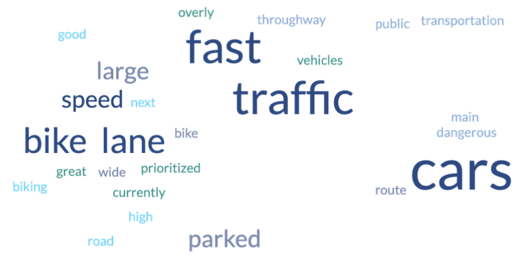
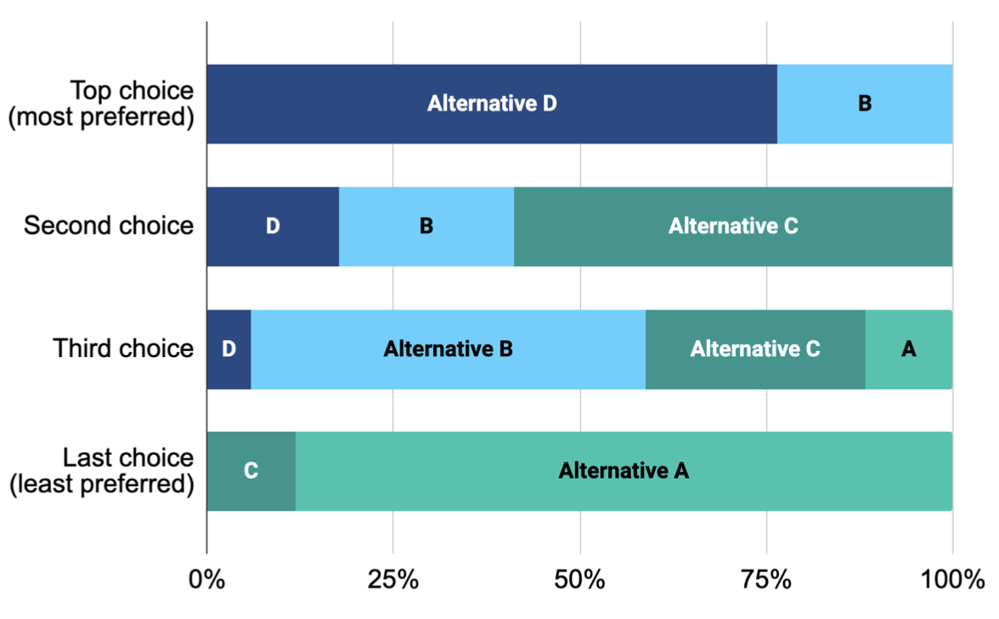
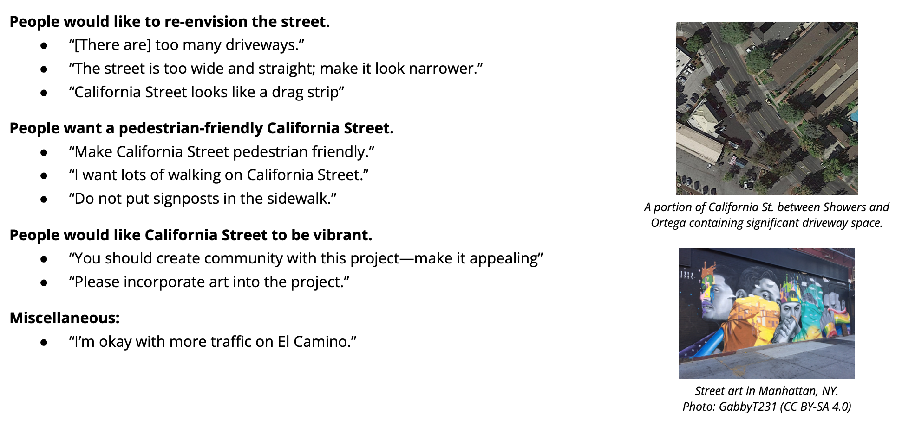

# Public input framework

## General collection

Participant data should be collected. This includes the number of participants/respondents, in addition to their connection to the topic. Relevant demographic data (self-reported age/gender/ethnicity/etc—all optional questions) should also be collected.

#### Current status + future vision (word clouds)

Example question: when you think about the current status of \___, which words currently come to mind?

Example question: in a few words, what do you envision for the future of \____?

Data visualization: for each question, create a word cloud with [freewordcloudgenerator.com](https://freewordcloudgenerator.com).
- Configuration
    - Data: paste/type
        - Edit the input data by fixing typos, standardizing inputs (ex: "Rd" and "Road" are the same thing—convert them to one option), and more, at the discretion of the editor.
        - Note: There is no way to make multi-word phrases. If you need a multi-word phrase, edit the data to replace spaces in phrases with underscores, and then edit out the underscore in the final exported image. This can be done with basically any image editing program.
    - Font: Lato
    - Color: delete all existing colors and then use rgb(38, 73, 133), rgb(123, 137, 174), rgb(137, 173, 213), rgb(81, 208, 254), rgb(25, 150, 142). These colors match Mountain View's logo's color scheme.
    - Background: transparent
    - Number of words: 25
- Note: If you do not like how the word cloud is distributed, you can click to regenerate it.
- Example:

#### Specific policies (graph + images)

This section may vary depending on the project in consideration. Overall, the goal is to have participants vote for various options.

Example question: please rank the following options in order of preference (1 = most preferred; 5 = least preferred).

Data visualization: stacked bar chart + image visualization or explanation of options on the side
- Google Sheets can be used to make a chart; however, feel free to use your editor of choice.
- Make sure that the font size is legible.
- Example:

#### Miscellaneous (quotes)
It can be useful to have participant quotes to illustrate certain viewpoints. Always obtain consent to capture, record, or write down quotes, whether they are gathered in person or online.

Data visualization: varies (see suggestions)
- If using multiple quotes, they can be grouped by subject or topic.
- Quotes should be attributed if the speaker's identity is relevant (ex: the mayor). Otherwise, they can be attributed anonymously (ex: a Mountain View Resident).
- Quotes can be paired with visuals or images.
- Example:

## Online data collection

### Collection mechanisms
There are many different ways to collect public input data online. This section outlines our preferred practices.

#### Preferred mechanisms (Zoom + Google Forms)
Public input data can be collected online either synchronously (Zoom meeting) or asynchronously (Google Forms).

#### Additional mechanism (email)
Data collection is also possible through email; however, it is harder to standardize and summarize this format. In the event that email is used (and it may be useful for people not comfortable with Zoom or Google Forms), the simplest way to integrate it is by sending a copy of the Google Form questions over email. This allows the data collected to be analyzed together with the Google Form data.

TODO: quotes only if submitting non-standard format email (ex: not google forms questions)

---

## In-person data collection

### Collection mechanisms

#### Forms
Paper forms can be used to replicate the Google Forms experience. A Google Form link can also be given out in-person. Note that paper forms will require additional work, as someone will have to transcribe them.

#### Voting
Participants can be asked to raise their hands to vote on specific questions. This is easier with smaller numbers of people. Note that someone will have to count the number of responses. Also, it is good to know the total number of people in the room to look at people who abstain from voting on certain questions. Explicitly collecting data how many participants have no preference on a specific question is also encouraged.

#### Quotes
Live quotes can be collected by recording and then transcribing portions of the event. They can also be collected by someone who writes them down live. Alternatively, quotes can be collected by paper or online (see the forms section).

---

## Double-counting
There is a chance that participants will engage with multiple collection mechanisms (ex: Zoom and Google Forms). As a result, their opinions may be double-counted. Future work is required to determine the extent to which this may be an issue; however, one simple workaround would be to have a question asking if the user has previously provided feedback regarding a specific project.

TODO: anecdotally, this doesn't happen a lot
